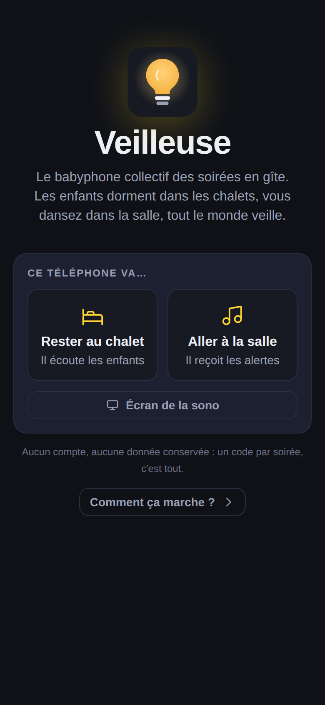
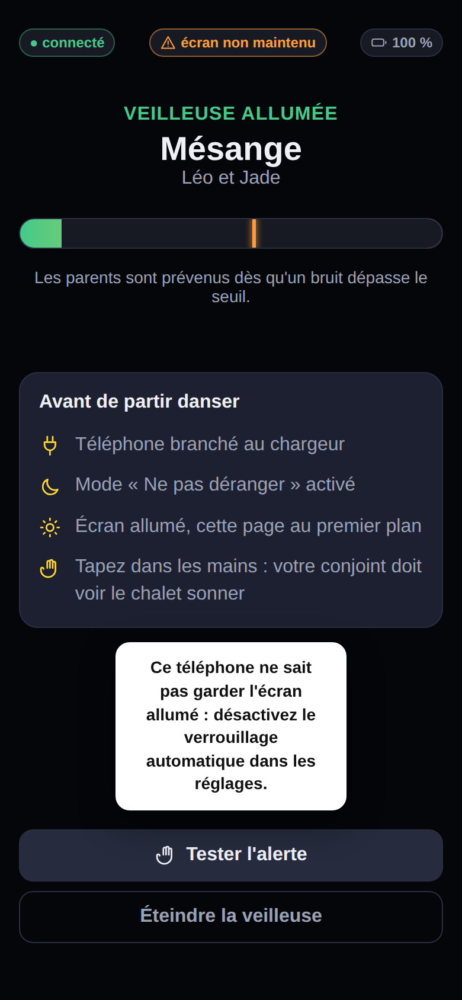
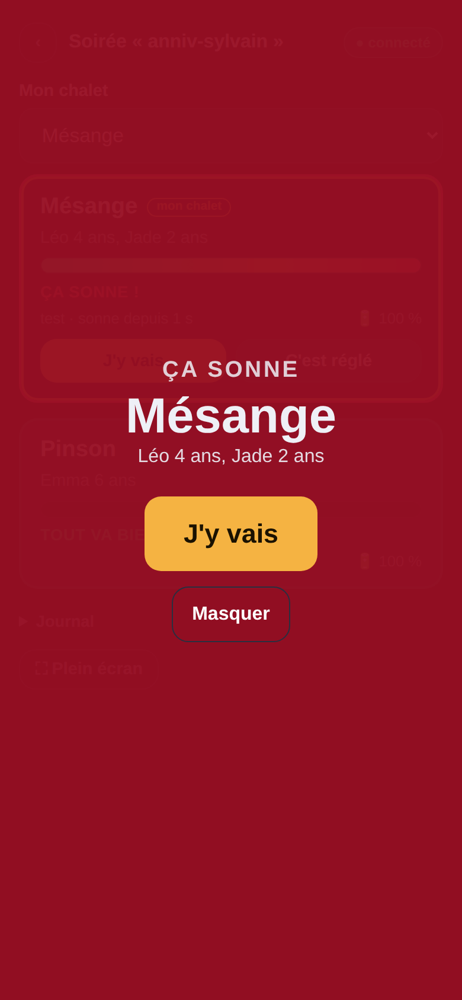
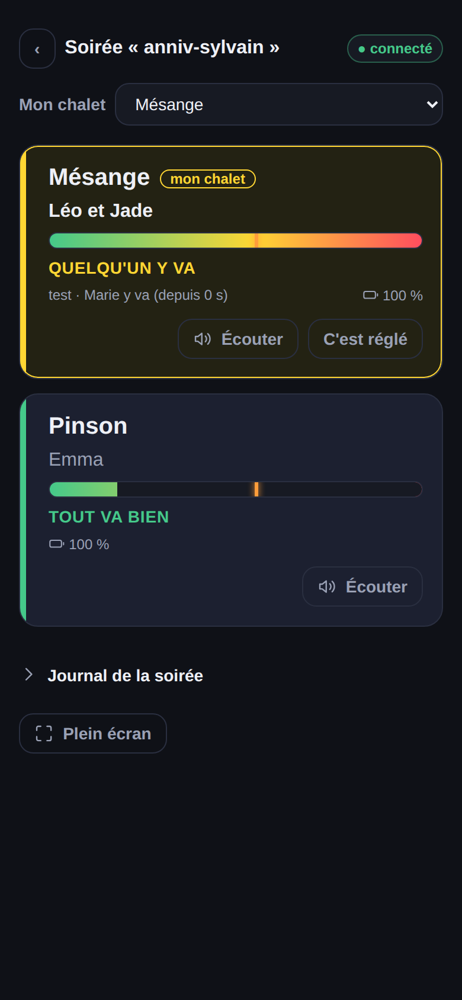

<p align="center">
  
</p>
<h1 align="center">Veilleuse</h1>
<p align="center"><strong>Le babyphone collectif des soirées en gîte.</strong><br>
Les enfants dorment dans les chalets, les parents dansent dans la salle, tout le monde veille.</p>

<p align="center">
  <a href="#démarrage-rapide">Démarrage rapide</a> ·
  <a href="#le-soir-de-la-fête">Le soir de la fête</a> ·
  <a href="#comment-ça-marche">Comment ça marche</a> ·
  <a href="#déploiement">Déploiement</a> ·
  <a href="#limites-connues">Limites connues</a>
</p>

---

<p align="center">
  &nbsp;
  &nbsp;
  &nbsp;
  
</p>
<p align="center"></p>

## Le problème

Une fête dans un domaine de chalets. À 22 h, on couche les enfants dans les chalets, à 100 ou 300 mètres de la salle. La musique est à fond. Un babyphone classique ne porte pas si loin et personne ne l'entendrait de toute façon. On ne veut pas laisser les enfants seuls, on ne veut pas non plus qu'un parent sacrifie sa soirée à chaque chalet.

## La solution

Chaque couple laisse un téléphone dans le chalet et garde l'autre à la soirée. **Veilleuse** est une webapp, sans installation ni compte : un code de soirée, un prénom, et deux rôles.

- **Je reste au chalet** — le téléphone écoute. Il analyse le micro localement et n'envoie que de minuscules messages : un battement de cœur toutes les 15 secondes, une alerte quand un bruit dépasse le seuil, un clip audio de 4 secondes si le réseau le permet.
- **Je vais à la salle** — le téléphone reçoit. Une tuile par chalet, verte / orange / rouge. Quand un chalet sonne, tout le monde le voit, le couple concerné reçoit une alerte forte, les autres une alerte douce. Le premier qui tape **« J'y vais »** prévient tous les autres. Un bouton **« 🔊 Écouter »** permet à tout moment de se faire renvoyer 10 secondes de son du chalet.
- **Écran de la sono** — le même tableau en plein écran sur le PC qui passe la musique. Un chalet qui sonne remplit l'écran de rouge avec son nom en géant, le DJ peut baisser le son et l'annoncer au micro.

Et surtout, **le silence est une alerte** : si un chalet ne donne plus de nouvelles pendant 45 secondes (téléphone verrouillé, batterie vide, réseau perdu), il passe en « chalet muet » sur tous les écrans. Un babyphone qui se tait ne rassure personne.

## Démarrage rapide

```bash
git clone https://github.com/sylvainPgt/veilleuse.git
cd veilleuse
pip install -r requirements.txt
uvicorn app.main:app --reload
```

Ouvrez http://localhost:8000. Pour tester à la maison : le mode chalet sur un téléphone dans une chambre, le mode salle sur un autre, coupez la 4G du premier trente secondes et regardez la tuile passer en « chalet muet », puis revenir.

> Le micro n'est accessible qu'en HTTPS (ou sur `localhost`). Pour tester depuis un téléphone sur le réseau local, passez par un tunnel HTTPS ou déployez directement (voir plus bas).

Avec Docker :

```bash
docker compose up --build
```

Tests :

```bash
pip install -r requirements-dev.txt
pytest
```

## Le soir de la fête

1. Avant la fête, ouvrez l'adresse de l'app sur le téléphone de chaque parent et ajoutez-la à l'écran d'accueil. Choisissez un code de soirée et donnez-le à tout le monde.
2. Au coucher, sur le téléphone qui reste au chalet : **« Je reste au chalet »**, nom du chalet, prénoms des enfants, réglage de la sensibilité avec la barre de niveau (parler normalement doit rester sous le trait, un pleur doit le dépasser), puis **« Allumer la veilleuse »**.
3. Checklist affichée à l'écran : chargeur branché, mode « Ne pas déranger », écran allumé avec l'app au premier plan, et **un test en tapant dans les mains** — le conjoint doit voir le chalet sonner sur son téléphone avant de partir.
4. Sur le téléphone qui va à la salle : **« Je vais à la salle »**, tapez sur **« Activer les alertes »** (nécessaire pour que le navigateur ait le droit de sonner et vibrer), choisissez « Mon chalet » dans la liste.
5. Sur le PC de la sono : **« Écran de la sono »**, puis plein écran.
6. Quand ça sonne : n'importe qui tape **« J'y vais »**. Si personne ne répond en 90 secondes, l'alerte passe en escalade rouge clignotant sur tous les téléphones. Une fois sur place, **« C'est réglé »**.

Veilleuse entend, elle ne voit pas : elle détecte les pleurs et les bruits, comme un babyphone audio — pas un enfant qui se lève ou a un souci sans faire de bruit.

## Comment ça marche

```
   Chalet Mésange                          Serveur (FastAPI)                      Salle
 ┌──────────────────┐   hb 15 s (200 o)   ┌──────────────────┐   état complet   ┌──────────────┐
 │ micro → RMS → dB │ ──────────────────► │ Party            │ ───────────────► │ tuiles       │
 │ seuil + 1,5 s    │   alert (200 o)     │  ├ Chalet ×N     │   WebSocket      │ overlay      │
 │ file hors ligne  │ ──────────────────► │  ├ événements    │ ◄─────────────── │ J'y vais     │
 │ wake lock        │   clip 4 s (≤150 Ko)│  └ watchdog 2 s  │   ack / resolve  │ écran sono   │
 └──────────────────┘ ──────────────────► └──────────────────┘                  └──────────────┘
```

**Conçu pour un réseau faible.** La détection se fait sur le téléphone du chalet, jamais en streaming. Ce qui transite est minuscule et passe en 3G. Le clip audio est un bonus envoyé après l'alerte, abandonné s'il est trop gros. Si la connexion tombe, l'émetteur met ses alertes en file et les renvoie à la reconnexion (backoff exponentiel, 1 s → 15 s).

**Détection.** Niveau sonore en RMS converti en dB, lissé avec attaque rapide et retombée douce. Un bruit au-dessus du seuil pendant environ 1,5 seconde cumulée déclenche l'alerte ; un bref creux ne remet pas le compteur à zéro. Un bruit court est signalé en orange sans alerter. Après une alerte, 30 secondes de pause avant la suivante ; une alerte en cours absorbe les nouveaux bruits au lieu de se dupliquer.

**Watchdog serveur.** Toutes les 2 secondes : un chalet sans heartbeat depuis 45 s devient « muet » ; une alerte non acquittée depuis 90 s passe en « escalade ». Les deux délais se règlent par variables d'environnement (`VEILLEUSE_HEARTBEAT_TIMEOUT`, `VEILLEUSE_ESCALATION_DELAY`).

**Aucune donnée conservée.** Tout est en mémoire, rien n'est écrit sur disque. Un clip s'efface dès que l'alerte est réglée, et de toute façon au bout de deux minutes (`VEILLEUSE_CLIP_TTL`) — clip d'alerte compris : aucun son d'un chalet ne traîne sur le serveur, et les réponses de l'API sont servies en `no-store`. Les soirées s'oublient toutes seules : 15 minutes pour une soirée restée vide (`VEILLEUSE_PARTY_EMPTY_TTL`), 24 heures sans activité pour les autres (`VEILLEUSE_PARTY_TTL`).

**Un redémarrage du serveur ne casse pas les liens.** Les identifiants de soirée sont signés (HMAC) avec `VEILLEUSE_SECRET` : un lien valide recrée sa soirée vide au premier retour, et les chalets se ré-enregistrent tout seuls. **Définissez `VEILLEUSE_SECRET`** (une longue valeur aléatoire) en production — sans elle, un secret est tiré à chaque démarrage et les liens meurent avec le processus. Un redémarrage du serveur vide l'état ; les émetteurs se ré-enregistrent automatiquement à la reconnexion.

### Protocole WebSocket (`/ws/{code}`)

| Sens | Message | Rôle |
|---|---|---|
| → | `{"type":"register","chalet_id","name","kids"}` | Émetteur : rejoint (ou reprend) un chalet |
| → | `{"type":"hb","level","battery","threshold"}` | Émetteur : battement de cœur |
| → | `{"type":"noise","level"}` | Émetteur : bruit court |
| → | `{"type":"alert","level","clip?","reason?"}` | Émetteur : alerte (le clip peut arriver dans un second message) |
| → | `{"type":"hello","role":"salle","name"}` | Récepteur : s'identifie |
| → | `{"type":"ack","chalet_id","by"}` / `resolve` | Récepteur : j'y vais / c'est réglé |
| → | `{"type":"listen","chalet_id","by"}` | Récepteur : fais-moi entendre ce qui se passe maintenant |
| ← | `{"type":"clip_request","seconds","by"}` | Serveur → émetteur seul : enregistre et renvoie |
| → | `{"type":"clip","chalet_id","clip"}` | Émetteur : voici l'enregistrement demandé |
| ← | `{"type":"clip_ready","chalet_id","ts"}` / `listen_failed` | Serveur : le clip est prêt / l'écoute a échoué |
| ← | `{"type":"state", chalets:[…], events:[…], now}` | Serveur : état complet à chaque changement |
| ← | `{"type":"level","chalet_id","level","battery","ts"}` | Serveur : mise à jour légère de la barre de niveau |

`POST /api/parties {name}` crée une soirée et renvoie son identifiant ; `GET /api/party/{code}` renvoie l'état (404 si l'identifiant est inconnu) ; `GET /api/health` pour la supervision. La page `/admin`, protégée par `VEILLEUSE_ADMIN_TOKEN` (en-tête `X-Admin-Token`), liste et supprime les soirées.

### Qui peut entrer

L'identifiant d'une soirée est son secret : `les-40-ans-de-silou-4u7t3dydqf`, dont les dix derniers caractères sont tirés au hasard. **Rien n'est créé implicitement** — se connecter à un identifiant inconnu répond `unknown_party` au lieu d'ouvrir une soirée vide, donc deviner un nom ne mène nulle part. L'organisateur crée sa soirée, reçoit un lien, et le partage ; il n'existe aucune liste publique. L'identifiant voyage dans le fragment de l'URL (`/#...`), qui n'est envoyé ni au serveur ni dans l'en-tête `Referer`.

Créer reste ouvert à tous : chacun fait sa soirée et partage son propre lien. Deux groupes peuvent donner le même nom à la leur sans se croiser.

## Déploiement

Le dépôt contient un `Dockerfile` prêt pour **Coolify**, Dokku, Fly.io, Railway ou n'importe quel hôte Docker : créez une application depuis ce dépôt Git, port `8000`, et activez le HTTPS (indispensable pour le micro, le wake lock et les notifications). Rien d'autre à configurer, pas de base de données.

Prévoyez de tester **sur place, dans un chalet, avec l'opérateur de chaque couple** — « il y a du réseau » vu de l'accueil ne dit rien du chalet du fond. L'app vous le dira en trente secondes : si la tuile est verte, ça passe.

## Limites connues

- **L'app doit rester au premier plan sur le téléphone du chalet**, écran allumé. iOS et Android coupent le micro d'un onglet en arrière-plan. Le wake lock empêche la mise en veille (une pastille ⚠️ s'affiche s'il n'est pas disponible, notamment avant iOS 16.4 — désactivez alors le verrouillage automatique), mais si quelqu'un verrouille l'écran, le chalet passera « muet » au bout de 45 secondes — c'est voulu, on préfère une fausse alerte à un faux silence.
- **Un appel entrant** sur le téléphone du chalet interrompt le micro (surtout sur iPhone). D'où le mode « Ne pas déranger ».
- **La page ouverte reste le chemin le plus fiable.** La sonnerie forte vient d'elle. En complément, les alertes sont **poussées en Web Push** : elles arrivent en notification même app fermée ou téléphone verrouillé — fiable sur Android, et sur iPhone à condition d'avoir ajouté Veilleuse à l'écran d'accueil (iOS 16.4+). Les clés de push dérivent de `VEILLEUSE_SECRET` : rien d'autre à configurer, mais un secret stable est indispensable. L'écran de la sono reste le filet de sécurité de tout le monde.
- **Pas de flux continu** (volontairement) : en réseau faible, un flux permanent est la première chose qui casse. À la place, le bouton **« 🔊 Écouter »** demande au chalet d'enregistrer 10 secondes et de les renvoyer — une écoute à la demande, en quasi-direct, qui garde les mêmes propriétés réseau que le reste. Le chalet affiche qui écoute et le journal le trace.
- Ce n'est **pas un dispositif médical ni de sécurité** : c'est un outil d'entraide entre parents pour une soirée, pas un remplacement de la surveillance.

## Pile technique

Python 3.12, FastAPI, WebSockets, et une page HTML/CSS/JS sans framework ni dépendance. Environ 300 lignes de Python, 400 de JavaScript.

## Licence

MIT — faites-en bon usage, et bonne fête.
